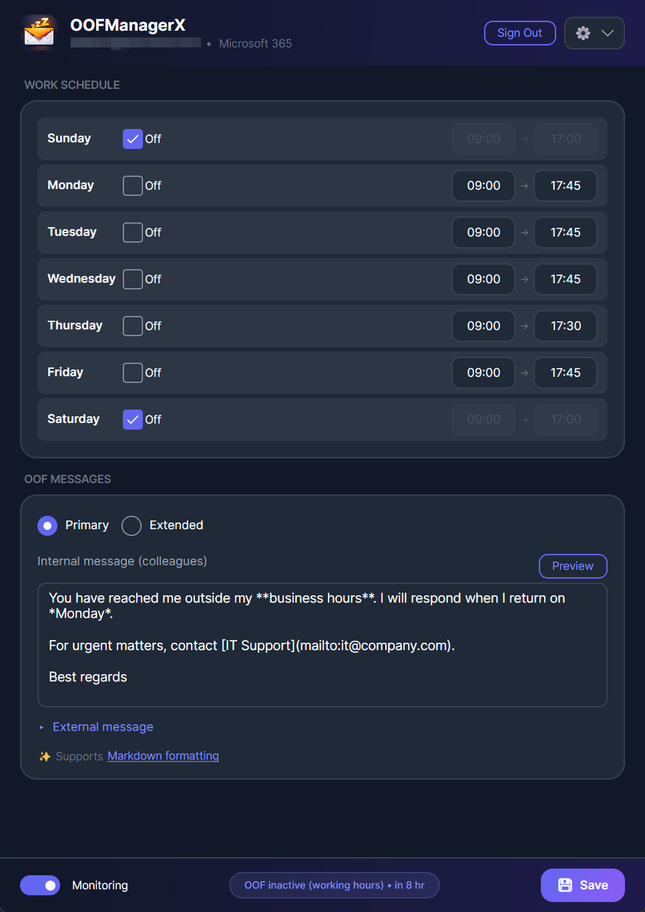

# OOFManagerX

Automatic Out-of-Office Manager for Microsoft 365.

OOFManagerX monitors your work schedule and manages your Out-of-Office (OOF) replies automatically. Define your working hours once, and OOFManagerX handles the rest -- enabling OOF when you leave and disabling it when you return, with no manual intervention required.



## Features

### Schedule-Based OOF Management
- Configure working hours for each day of the week
- Mark days as off-work (weekends, recurring days off)
- OOF replies activate automatically outside working hours
- Background monitoring syncs with Microsoft 365 every 1-60 minutes (configurable)

### Resilient Scheduling
- Uses Microsoft 365 scheduled mode so OOF activates even if your PC is disconnected
- Periodic verification ensures the schedule hasn't been removed or overridden
- Handles weekends and consecutive off-days as a single OOF period (e.g., Friday 5pm to Monday 9am)

### Message Management
- Separate internal (colleagues) and external (outside contacts) OOF messages
- Markdown formatting support with browser-based preview
- External audience control: None, Contacts Only, or All
- Extended OOF mode for vacations with a return date

### Microsoft 365 Integration
- Secure authentication via Microsoft Identity (MSAL) with Windows Account Manager
- Direct mailbox settings management through Microsoft Graph API
- Changes are immediately reflected in Outlook and OWA

### Desktop Integration
- System tray with minimize-to-tray behavior
- Start at Boot option (via Windows registry)
- Configurable sync interval (1 min, 5 min, 15 min, 30 min, 1 hour)
- Automatic update notifications from GitHub Releases

## Getting Started

### Prerequisites
- Windows 10 (version 1903+) or Windows 11
- x64 or ARM64 processor
- Microsoft 365 work or school account

### Installation

Download the latest release from the [Releases](https://github.com/daesteves/OOFManagerX/releases) page. Two options are available for each platform (x64 and ARM64):

#### Option 1: MSIX Installer (Recommended)

Download `OOFManagerX-<version>-win-x64-msix.zip` (or `arm64`).

1. Extract the zip
2. Right-click `Install-OOFManagerX.ps1` → **Run with PowerShell**
3. Accept the admin prompt — the script installs the certificate and app automatically
4. OOFManagerX appears in your **Start Menu**

> The MSIX installer provides clean install/uninstall, Start Menu integration, and automatic app isolation. Recommended for most users.

#### Option 2: Portable EXE

Download `OOFManagerX-<version>-win-x64.zip` (or `arm64`).

1. Extract the zip to a folder of your choice (e.g., `C:\Tools\OOFManagerX`)
2. Run `OOFManagerX.exe` from that folder

> **Important:** Keep all files from the zip together in the same folder. The `.dll` files are required native libraries and must be alongside the `.exe`.

### First Run

1. Launch OOFManagerX
2. Click **Sign In** to authenticate with your Microsoft 365 account
3. Configure your work schedule (start/end times, days off)
4. Write your OOF messages (internal and external)
5. Click **Save** -- OOFManagerX will begin managing your OOF automatically

The app minimizes to the system tray when closed. Right-click the tray icon for quick access.

## Configuration

### Work Schedule
Set your typical working hours for each day. OOF activates outside these hours and on days marked as off-work.

### Sync Interval
Access via the gear menu. Controls how often OOFManagerX checks and updates your M365 OOF settings. Default is 5 minutes.

### Settings Storage
Settings are stored locally in `%LocalAppData%\OOFManagerX\`:
- `schedule.json` -- work schedule and OOF messages
- `msal_cache.bin` -- encrypted authentication token cache
- `logs/` -- application logs

## Technical Details

### Architecture
```
src/
  OOFManagerX.Core/   -- Business logic, services, models (UI-agnostic)
  OOFManagerX.App/    -- Avalonia UI application
tests/
  OOFManagerX.Core.Tests/  -- Unit tests
```

### Built With
- .NET 8.0
- Avalonia UI 11 with Fluent theme
- MSAL (Microsoft Authentication Library)
- Microsoft Graph API
- CommunityToolkit.Mvvm

### Permissions Required
- `User.Read` -- read your profile information
- `MailboxSettings.ReadWrite` -- manage OOF settings

## Build from Source
```bash
git clone https://github.com/daesteves/OOFManagerX.git
cd OOFManagerX
dotnet build src/OOFManagerX.App/OOFManagerX.App.csproj
dotnet run --project src/OOFManagerX.App/OOFManagerX.App.csproj
```

## Acknowledgments

Inspired by the original [OOFSponder](https://github.com/evanbasalik/oofsponder) by Evan Basalik and Cameron Battagler.

## License

MIT License -- see [LICENSE](LICENSE) for details.